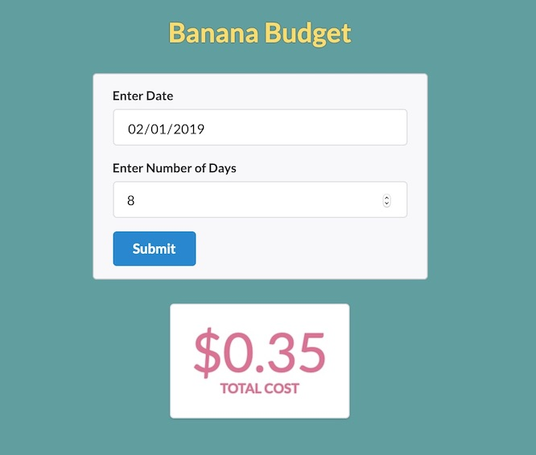

# banana-budget

A tool used to calculate "Bob's Banana Budget".

### [Live Demo Here](https://banana-budget-fr.herokuapp.com/)

## Installation

**1.** Clone or Download the repository
```
git clone https://github.com/frendon001/banana-budget.git
```

**2.** Install server libraries in root directory:
```
npm install
```
**2.** Install client libraries in client directory:
```
cd client
yarn install
```

**2.** Run application locally (Server and UI):
```
npm run dev
```

## Loaded Application



## Technologies Used

### Front-End
- React
- Formik
- Axios
- Semantic UI

### Back End
- Node
- Express
- Mocha
- Chai


## Testing
To run API Tests, close any running processes and then run the following command:
```
npm test
```


# Authors
- Fausto Rendon (https://github.com/frendon001)

